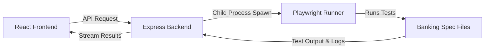

# Banking QA Automation Portal

A full-stack test execution dashboard built with **React (Vite)**, **Node.js (Express)**, and **Playwright (TypeScript)**. This application allows QA engineers and stakeholders to select banking projects and test suites, run automated tests from the browser, and view execution outputs in real-time.

---

## Architecture Overview



- **Frontend**: React + Vite (dark mode UI, dynamic configuration, localized run execution history).
- **Backend**: Express.js server (safely executes Playwright tests via `child_process.spawn` with whitelist validation and concurrency prevention).
- **Automation**: Playwright + TypeScript configured with HTML reports, screenshot/video on failure.

---

## Local Setup

### 1. Backend Setup
1. Navigate to the backend folder:
   ```bash
   cd backend
   ```
2. Install dependencies:
   ```bash
   npm install
   ```
3. Start the server:
   ```bash
   npm start
   ```
   The backend will start on `http://localhost:5000`.

### 2. Frontend Setup
1. Navigate to the frontend folder:
   ```bash
   cd frontend
   ```
2. Install dependencies:
   ```bash
   npm install
   ```
3. Start the Vite dev server:
   ```bash
   npm run dev
   ```
   The frontend will start on `http://localhost:3000`.

### 3. Automation Setup
1. Navigate to the automation folder:
   ```bash
   cd automation
   ```
2. Install dependencies (including Playwright browsers):
   ```bash
   npm install
   npx playwright install --with-deps
   ```

---

## Deployment Guide

### Part 1: Backend Deployment on Render

Because Playwright requires browser binaries (Chromium, Firefox, WebKit) and OS-level libraries (fonts, graphics libraries), a standard Node web service on Render will fail to execute Playwright tests directly due to missing dependencies. 

There are **two ways** to resolve this on Render:

#### Option A: Docker Deployment (Recommended)
By using a Docker container, we can leverage the official Playwright image which has all required browsers and libraries pre-installed.

1. In the `backend` folder, create a `Dockerfile`:
   ```dockerfile
   FROM mcr.microsoft.com/playwright:v1.44.0-jammy

   # Set working directory
   WORKDIR /app

   # Copy both backend and automation folders
   COPY backend ./backend
   COPY automation ./automation

   # Install dependencies for both
   cd /app/automation && npm install
   cd /app/backend && npm install

   # Expose port and start
   EXPOSE 5000
   ENV PORT=5000
   WORKDIR /app/backend
   CMD ["node", "server.js"]
   ```
2. Create a Web Service on Render.
3. Select your repository.
4. Set the **Runtime** to `Docker`.
5. Under Environment variables, add:
   - `PORT`: `5000`
   - `ALLOWED_ORIGINS`: `https://your-frontend-vercel-url.vercel.app` (optional, restricts access to your frontend).

#### Option B: Standard Node.js Web Service (Build Command Modification)
If you prefer not to use Docker, you can configure Render to install the dependencies during the build:

1. Create a Web Service on Render and choose the **Node** runtime.
2. Set the **Root Directory** to `playwright-test-portal/backend` (or root, adapting commands).
3. Set the **Build Command** to:
   ```bash
   npm install && cd ../automation && npm install && npx playwright install --with-deps
   ```
4. Set the **Start Command** to:
   ```bash
   node server.js
   ```
5. Set Environment Variables:
   - `PORT`: (Render sets this automatically)
   - `ALLOWED_ORIGINS`: `https://your-frontend-vercel-url.vercel.app`

---

### Part 2: Frontend Deployment on Vercel

Vercel is optimized for static sites built with Vite.

1. Log in to Vercel and click **Add New Project**.
2. Select your GitHub repository.
3. Configure the Project Settings:
   - **Framework Preset**: `Vite` (automatically detected)
   - **Root Directory**: `playwright-test-portal/frontend` (crucial to point to the frontend subdirectory)
4. Under **Environment Variables**, add:
   - **Key**: `VITE_API_URL`
   - **Value**: `https://your-backend-render-url.onrender.com` (Note: **Do not** add a trailing slash `/`)
5. Click **Deploy**.

---

## Troubleshooting CORS Issues
- If you see `CORS block` or `Network Error` in the browser console, double-check that your Vercel URL is listed in the `ALLOWED_ORIGINS` environment variable on Render, or that `ALLOWED_ORIGINS` is not blocking requests.
- Verify that `VITE_API_URL` on Vercel matches your Render URL exactly (including `https://` but without a trailing slash).
